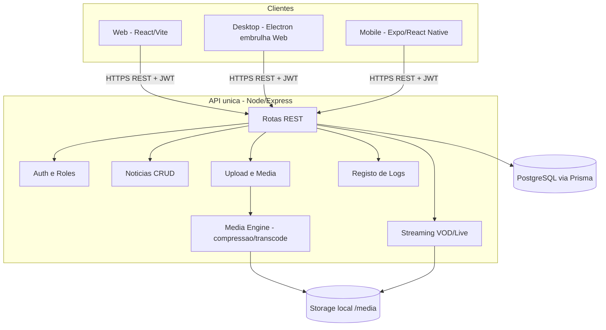

# ISPTEC News — Plano-Mestre

> Documento de planeamento (TAREFA OBRIGATÓRIA antes de qualquer código).
> Referência de avaliação: **documentação oficial do professor** (`teacher-documentation.pdf`).
> Tema: **Grupo 26 — Plataforma de Notícias Multimédia.**
> **Atualização (2026-06-02):** PostgreSQL + Docker · TypeScript em toda a stack · pnpm workspaces com `packages/shared` (código partilhado).

---

## 1. Identificação e enquadramento

| Item | Valor |
|---|---|
| Projeto | ISPTEC News — Plataforma de Notícias Multimédia |
| Cadeira | Multimédia 2026 (Projeto Final) |
| Grupo | 2 estudantes (ambos programam; avaliação individual) |
| Defesa | Apresentação 5min + Demonstração 10min + Questionamento individual 5min/aluno |

### Critérios de avaliação (pesos do professor)

| Critério | Peso |
|---|---|
| Funcionalidades Obrigatórias | 25% |
| Arquitetura Cliente-Servidor | 25% |
| Streaming | 15% |
| Compressão Multimédia | 10% |
| Interface / UX | 10% |
| Defesa Individual | 10% |
| Documentação | 5% |

### 🔴 Reprovação automática (não negociável)
- Sem **compressão** → reprova.
- Sem **streaming** → reprova.
- Sem **cliente multiplataforma** → reprova.
- Plágio → zero para todos. Ausência na defesa → zero.

> Conclusão de prioridade: **compressão e streaming são feitos cedo e a sério**, antes de polir os 3 clientes.

---

## 2. Decisões fechadas (stack)

| Camada | Tecnologia | Porquê |
|---|---|---|
| **Linguagem** | **TypeScript** em toda a stack (API · Web · Mobile · shared) | Tipos partilhados, menos bugs |
| **Monorepo** | **pnpm workspaces** + `packages/shared` (`@isptec/shared`) | Tipos, schemas zod e cliente-API reutilizados pelos 3 clientes |
| **API** | Node.js + Express + Prisma (TypeScript) | Linguagem única com os clientes; streaming por Range trivial; ecossistema media (sharp, ffmpeg) |
| **BD** | **PostgreSQL 16** — Docker local → gerido em prod | Mesma BD em dev e prod (paridade via Docker); Prisma como ORM |
| **Web** | React + Vite + TypeScript | Base reutilizada pelo Desktop |
| **Desktop** | Electron (embrulha o build da Web) | Cliente Desktop multiplataforma (Win/Linux/macOS) quase sem custo extra |
| **Mobile** | Expo (React Native) + TypeScript | Cliente Mobile multiplataforma (Android/iOS) |
| **Media (imagem)** | `sharp` + algoritmo próprio (Huffman/RLE/DCT) | Codecs reais + demonstração de conhecimento |
| **Media (áudio/vídeo)** | `fluent-ffmpeg` (ffmpeg) | H.264/H.265/VP9, MP3/AAC/OGG, HLS |
| **Auth** | JWT + bcrypt | Segurança básica exigida |
| **Validação** | zod | Validação de inputs |
| **Storage** | Sistema de ficheiros local controlado pela API | Zero-cost; abstraído para futura migração R2 |

---

## 3. Arquitetura cliente-servidor



**Princípios:** backend único; apps independentes mas com **pacote partilhado** `@isptec/shared` (tipos TypeScript + validação zod) via pnpm workspaces; o Desktop reutiliza o build da Web; o Mobile reutiliza `@isptec/shared`.

---

## 4. Estrutura do repositório

```text
isptec-news/
  apps/
    api/                  # Node + Express + Prisma (TypeScript)
      src/
        routes/           # auth, news, media, users, stream, logs
        middleware/       # auth, roleGuard, validate, requestLogger
        lib/              # prisma client, logger
        media-engine/     # NÚCLEO MULTIMÉDIA (académico)
          image.ts        # sharp -> jpeg/png/webp + métricas
          audio.ts        # ffmpeg -> mp3/aac/ogg
          video.ts        # ffmpeg -> h264/h265/vp9 + thumbnail + HLS
          huffman.ts      # algoritmo PRÓPRIO (lossless)
          dct.ts          # (opcional) DCT+quantização: núcleo do JPEG
          report.ts       # tamanho, taxa, tempo, qualidade
        env.ts            # validação de ambiente (zod)
        app.ts            # express app
        index.ts          # arranque do servidor
      prisma/             # schema.prisma, migrations, seed.ts
      .env.example        # DATABASE_URL, JWT_SECRET, PORT, MEDIA_DIR
    web/                  # React + Vite + TS (reutilizada pelo Desktop)
    desktop/              # Electron (dev: localhost:5173 / prod: web/dist)  [Fase 4]
    mobile/               # Expo (React Native + TS)                          [Fase 4]
  packages/
    shared/               # @isptec/shared: tipos + schemas zod + constantes
  media/                  # (gitignored) uploads/ + processed/
  docs/                   # plano, relatório técnico, manual, diagramas
  docker-compose.yml      # PostgreSQL 16 + Adminer
  pnpm-workspace.yaml
  tsconfig.base.json
  package.json            # scripts do monorepo
  README.md               # instalação, configuração, execução
```

---

## 5. Mapeamento dos conceitos de multimédia → onde são demonstrados

> Esta tabela é a peça académica central: cada exigência do professor tem um sítio concreto no código e uma evidência na defesa.

| Conceito (professor) | Onde está | Evidência na defesa |
|---|---|---|
| Compressão de **imagem** (JPEG/PNG/WebP) | `media-engine/image.js` (sharp) | Ecrã "Comparar": original vs WebP, lado a lado |
| Compressão de **áudio** (MP3/AAC/OGG) | `media-engine/audio.js` (ffmpeg) | Reprodução + tabela de tamanhos |
| Compressão de **vídeo** (H.264/H.265/VP9) | `media-engine/video.js` (ffmpeg) | Reprodução + tabela comparativa |
| **Algoritmo próprio** (Huffman / DCT) | `media-engine/huffman.js`, `dct.js` | "Explique este código" → demonstrar Huffman/JPEG |
| **Relatório comparativo** | tabela `MediaVariant` + `GET /media/:id/report` | Tamanho original/comprimido, **taxa**, **tempo**, qualidade |
| **Streaming VOD** | `services/streamService` (HTTP Range / HLS) | Seek/pause/play reais num vídeo |
| **Streaming tempo real** | rota `live` (MJPEG ou HLS-live) | Transmissão "notícia ao vivo" |
| **Streaming offline** | download + cache no cliente | Reproduzir media sem rede |
| **Pipeline de media** | upload → fila → processamento → variantes → entrega | Diagrama + logs em tempo real |
| **Arquitetura cliente-servidor** | API REST + 3 clientes | Diagrama da secção 3 |
| **Gestão de utilizadores/auth** | JWT + bcrypt + roles | Login ao vivo |
| **Gestão de permissões** | `middleware/roleGuard` | Tentar ação sem permissão → 403 |
| **Registo de logs** | `middleware/requestLogger` + tabela `Log` | Ecrã admin com logs ao vivo |
| **Segurança da comunicação** | HTTPS + JWT + validação zod | Justificar decisões |
| **Upload / Download** | `routes/media` + clientes | Demo de upload e download |

---

## 6. Pipeline de processamento de media (o "coração" multimédia)

```mermaid
sequenceDiagram
  participant C as Cliente
  participant A as API
  participant E as Media Engine
  participant S as Storage
  participant DB as BD
  C->>A: POST /media (upload ficheiro)
  A->>S: grava ORIGINAL
  A->>DB: Media(status=UPLOADED)
  A-->>C: 202 Accepted (id)
  A->>E: processar(media)
  Note over E: imagem: sharp -> webp/jpeg<br/>audio: ffmpeg -> mp3/aac<br/>video: ffmpeg -> h264/h265 + HLS<br/>proprio: huffman/dct
  E->>S: grava VARIANTES comprimidas
  E->>DB: MediaVariant[] (tamanho, taxa, tempo, qualidade)
  E->>DB: Media(status=READY)
  C->>A: GET /media/:id/report
  A-->>C: comparação (antes/depois)
```



**Antes vs depois** fica registado em `MediaVariant` e é mostrado no ecrã de comparação — exatamente o relatório que o professor pede (tamanho original, comprimido, taxa, qualidade, tempo).

---

## 7. Estratégia de streaming (15% + auto-fail)

> O master prompt subestimava isto ("simulação"). Aqui é **streaming real**.

### 7.1 VOD (Sob Demanda) — base
- Servir áudio/vídeo com **HTTP Range Requests** (`Accept-Ranges: bytes`, resposta `206 Partial Content`).
- O elemento HTML5 `<video controls>` / `<audio controls>` consome Range nativamente → entrega **Play, Pause, Stop, Avançar, Retroceder, Volume, Indicador de progresso** (todos os controlos mínimos exigidos) com seek real.
- **Upgrade (mostra pipeline):** gerar **HLS** (ffmpeg → `.m3u8` + segmentos `.ts`) para streaming segmentado/adaptativo.

### 7.2 Tempo real (Live)
- Abordagem simples e **genuína**, temática para notícias: **transmissão ao vivo** de um editor.
- Recomendado: **MJPEG over HTTP** (`multipart/x-mixed-replace`) — servidor empurra frames JPEG; cliente mostra num ``. Sem libs de cliente, é live a sério.
- Upgrade: **HLS ao vivo** (playlist rolante via ffmpeg).

### 7.3 Offline
- Download da variante processada para o dispositivo + reprodução local (Mobile: `expo-file-system`; Desktop: ficheiro local; Web: cache/IndexedDB).

---

## 8. Estratégia de compressão (híbrida)

| Tipo | Ferramenta (codec real) | Demonstração de conhecimento |
|---|---|---|
| Imagem | `sharp` → WebP/JPEG/PNG (qualidades variáveis) | **Huffman próprio** (lossless) + opcional **DCT+quantização** (núcleo do JPEG) |
| Áudio | `ffmpeg` → MP3/AAC/OGG (bitrates variáveis) | explicar trade-off bitrate↔qualidade |
| Vídeo | `ffmpeg` → H.264/H.265/VP9 (CRF variável) | explicar GOP, CRF, codecs |

**Por que híbrida:** implementar H.264 do zero é inviável; mas implementar **Huffman** (e, idealmente, **DCT+quantização** sobre uma imagem em tons de cinza) prova domínio real do conceito. Na defesa: *"o JPEG faz DCT → quantização → Huffman; nós implementámos esse núcleo aqui"*.

**Métricas registadas por variante:** tamanho original, tamanho comprimido, **taxa de compressão**, **tempo de processamento**, e um indicador de **qualidade** (ex.: PSNR para imagem).

---

## 9. Modelo de dados

```mermaid
erDiagram
  User ||--o{ News : escreve
  User ||--o{ Media : envia
  User ||--o{ Comment : comenta
  User ||--o{ Log : gera
  Category ||--o{ News : classifica
  News ||--o{ Media : contem
  News ||--o{ Comment : tem
  Media ||--o{ MediaVariant : gera

  User {
    string id PK
    string name
    string email UK
    string passwordHash
    enum role "ADMIN|EDITOR|READER"
    datetime createdAt
  }
  Category { string id PK; string name; string slug UK }
  News {
    string id PK
    string title
    string slug UK
    string summary
    string body
    enum status "DRAFT|PUBLISHED"
    string authorId FK
    string categoryId FK
    string coverMediaId FK
    int viewCount
    datetime publishedAt
    datetime createdAt
  }
  Media {
    string id PK
    enum type "IMAGE|AUDIO|VIDEO"
    string originalPath
    int originalSize
    string mimeType
    enum status "UPLOADED|PROCESSING|READY|ERROR"
    int durationMs
    int width
    int height
    string ownerId FK
    string newsId FK
    datetime createdAt
  }
  MediaVariant {
    string id PK
    string mediaId FK
    string label "ex: webp-q80, h264-720p, huffman-own"
    string format
    string codec
    string path
    int size
    float compressionRatio
    int processingMs
    float qualityScore
  }
  Comment { string id PK; string newsId FK; string userId FK; string body; datetime createdAt }
  Log {
    string id PK
    string level
    string action
    string userId FK
    string ip
    string method
    string path
    int statusCode
    string message
    datetime createdAt
  }
```

> `MediaVariant` é a tabela que materializa o **relatório de compressão** (antes/depois). `Log` cumpre o "registo de logs".

---

## 10. Segurança (mínimo viável exigido)

- **Autenticação:** JWT (access token) + palavra-passe com `bcrypt`.
- **Permissões:** middleware `roleGuard` (ADMIN/EDITOR/READER) por rota.
- **Validação:** `zod` em todos os inputs.
- **Comunicação:** HTTPS em produção (TLS do Render/Fly) + `helmet` + `cors` + `rate-limit` básico.
- **Logs:** todas as ações sensíveis registadas na tabela `Log`.

---

## 11. Deploy zero-cost

| Componente | Dev (local — principal p/ demo) | Produção grátis (bónus) |
|---|---|---|
| API | `localhost:3333` (máquina como host) | Render/Fly/Railway (free) via **Docker com ffmpeg** |
| BD | **PostgreSQL 16 em Docker** (`docker compose up -d`) | PostgreSQL gerido grátis: **Supabase / Neon / Railway / Render / Fly** |
| Storage | pasta `/media` | Cloudflare R2 (10GB grátis) |
| Web | `vite dev` | Vercel / Netlify |
| Desktop | `electron .` | build local (.exe / .AppImage / .dmg) |
| Mobile | Expo Go | Expo EAS / Expo Go (QR) na demo |

⚠️ **Nota ffmpeg:** muitos free tiers são efémeros (perdem ficheiros) e alguns não têm ffmpeg. Por isso a **demo principal corre localmente** (o professor permite "máquina como host"); produção é bónus.

**Configuração de ambiente:** cada cliente lê `API_BASE_URL` de variável de ambiente / config → trocar local↔produção é **uma variável** (cumpre "frontend aponta facilmente para a API em produção").

---

## 12. Ordem de implementação (fases)

> Regra de ouro: primeiro um **corte vertical** (API + compressão + streaming + **Web**) que cobre os itens de auto-fail; só depois replicar para Desktop e Mobile.

| Fase | Conteúdo | Saída |
|---|---|---|
| **0 — Fundação** | monorepo, `git init`, API skeleton, Prisma schema + migrate + seed (admin), `/health`, Web skeleton | Projeto arranca |
| **1 — Auth & domínio** | register/login JWT, roles, CRUD Notícias (draft/publish), categorias, logs middleware; Web: login + feed + detalhe + editor | App utilizável |
| **2 — 🔴 Media + Compressão** | upload, media-engine (image/audio/video), `MediaVariant`, **Huffman próprio**, endpoint + ecrã de relatório comparativo | Auto-fail #1 garantido |
| **3 — 🔴 Streaming** | VOD por Range (+HLS), player com todos os controlos, live (MJPEG), download offline | Auto-fail #2 garantido |
| **4 — Clientes** | Desktop (Electron embrulha Web); Mobile (Expo): login, feed, player, upload, offline | Auto-fail #3 garantido (3 clientes) |
| **5 — Segurança & polish** | helmet/cors/rate-limit/validação, estados de erro, UX | Qualidade |
| **6 — Entregáveis** | README, relatório técnico, manual, diagramas, **vídeo 5–10min**, seed de demo | Pronto para defesa |

---

## 13. Rastreabilidade requisito → avaliação

| Requisito obrigatório (professor) | Fase | Critério que pontua |
|---|---|---|
| API RESTful + BD | 0–1 | Arquitetura (25%) |
| Gestão de utilizadores + auth | 1 | Funcionalidades (25%) |
| Upload + compressão automática | 2 | Compressão (10%) + Func. (25%) |
| Relatório comparativo | 2 | Compressão (10%) |
| Streaming VOD + tempo real | 3 | Streaming (15%) |
| Download / offline | 3 | Func. (25%) |
| Cliente multiplataforma | 4 | Arquitetura (25%) |
| Permissões + logs | 1,5 | Func. (25%) |
| Segurança comunicação | 5 | Func. (25%) |
| Relatório, manual, README, vídeo | 6 | Documentação (5%) + Defesa (10%) |

---

## 14. Riscos e mitigações

| Risco | Mitigação |
|---|---|
| 3 clientes para 2 pessoas | Desktop reutiliza build da Web; Mobile só duplica cliente-API fino |
| ffmpeg em produção grátis | Demo principal local; produção via Docker (bónus) |
| Streaming subestimado | Tratado cedo (Fase 3), VOD real por Range + live MJPEG |
| Defesa individual (alterar código ao vivo) | Código simples, comentado; ambos programam todas as áreas |
| Plágio | Algoritmo próprio (Huffman/DCT) + commits incrementais no Git |

---

_Próximo passo sugerido: **Fase 0** — `git init` + scaffold do monorepo (API + Prisma + Web), com `/health` a responder._
