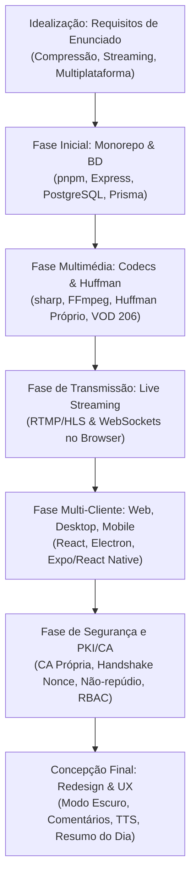

# Guia Completo de Estudo para Defesa — ISPTEC News

Este guia foi elaborado para te preparar detalhadamente para a defesa do projeto **ISPTEC News** perante o júri. Ele fornece a narrativa completa do projeto (desde a idealização até à concepção final), explica minuciosamente as escolhas arquiteturais, detalha as primitivas de segurança baseadas em certificados (PKI/CA) e aborda as decisões sobre compressão e streaming (incluindo os trade-offs de modelos não utilizados).

---

## 1. Por Onde Começar (Ordem de Estudo Recomendada)

Para dominares o projeto, não deves apenas decorar o código, mas compreender a lógica por trás de cada decisão técnica. Segue este roteiro:

1. **Visão Geral e Arquitetura (30 min):**
   - Lê o [README.md](file:///c:/Users/dalci/Videos/isptec-news/README.md) para compreender o arranque e a estrutura do monorepo.
   - Analisa o [ARCHITECTURE.md](file:///c:/Users/dalci/Videos/isptec-news/ARCHITECTURE.md) para mapear os endpoints e a comunicação entre os 3 clientes (Web, Desktop, Mobile) e a API.
   - Estuda o [RELATORIO-TECNICO.md](file:///c:/Users/dalci/Videos/isptec-news/docs/RELATORIO-TECNICO.md) para dominar a matriz de tecnologias.

2. **Segurança, Perfis e PKI/CA (60 min) — _Tópico Crítico_:**
   - Estuda o [SEGURANCA-PKI.md](file:///c:/Users/dalci/Videos/isptec-news/docs/SEGURANCA-PKI.md) para dominar o fluxo de assinatura e o handshake.
   - Analisa o código do middleware de validação de certificados em [deviceCert.ts](file:///c:/Users/dalci/Videos/isptec-news/apps/api/src/middleware/deviceCert.ts).
   - Percebe como as rotas de handshake e bypass estão estruturadas em [devices.ts](file:///c:/Users/dalci/Videos/isptec-news/apps/api/src/routes/devices.ts).
   - Revê a lógica criptográfica em [hashing, chaves e assinaturas](file:///c:/Users/dalci/Videos/isptec-news/apps/api/src/security/pki/cert.ts).

3. **Mecanismos de Compressão e Huffman (45 min):**
   - Analisa a orquestração do pipeline em [process.ts](file:///c:/Users/dalci/Videos/isptec-news/apps/api/src/media-engine/process.ts).
   - Estuda a implementação do algoritmo de [huffman.ts](file:///c:/Users/dalci/Videos/isptec-news/apps/api/src/media-engine/huffman.ts) e como extraímos os pixels brutos em [image.ts](file:///c:/Users/dalci/Videos/isptec-news/apps/api/src/media-engine/image.ts).
   - Revê os parâmetros dos codecs de áudio em [audio.ts](file:///c:/Users/dalci/Videos/isptec-news/apps/api/src/media-engine/audio.ts) e vídeo em [video.ts](file:///c:/Users/dalci/Videos/isptec-news/apps/api/src/media-engine/video.ts).

4. **Transmissão e Streaming (45 min):**
   - Entende o streaming sob demanda (VOD) com suporte a HTTP Range em [serve.ts](file:///c:/Users/dalci/Videos/isptec-news/apps/api/src/media-engine/serve.ts).
   - Estuda a ingestão da live por WebSocket e transcodificação para HLS em [hls.ts](file:///c:/Users/dalci/Videos/isptec-news/apps/api/src/live/hls.ts) e as rotas de controlo em [routes/stream.ts](file:///c:/Users/dalci/Videos/isptec-news/apps/api/src/routes/stream.ts).

---

## 2. Da Idealização à Concepção Final (A Narrativa do Projeto)

Ao seres questionado sobre a evolução do projeto, deves apresentar esta narrativa coerente:



1. **A Idealização:** O ISPTEC News nasceu da necessidade de criar um portal de notícias que distribuísse texto e conteúdos ricos (imagem, áudio e vídeo). As restrições do enunciado impunham três itens de reprovação automática (_auto-fail_): compressão multimédia real com métricas, streaming sob demanda/ao vivo e suporte a múltiplos clientes (Web, Desktop e Mobile).
2. **A Infraestrutura:** Adotámos um **monorepo pnpm** com **TypeScript** para partilha fácil de tipos (`@isptec/shared`) e segurança em tempo de compilação.
3. **O Motor de Média e Streaming:** Implementámos um pipeline de compressão baseado em `sharp` e `FFmpeg`, complementado por um compressor de Huffman próprio. O streaming sob demanda foi concebido com Range Requests (HTTP 206), permitindo seek arbitrário, e a live foi desenhada para correr no browser via WebSockets alimentando um conversor HLS.
4. **Os Clientes:** Criámos o cliente **Web** (React/Vite), envelopámos para **Desktop** (Electron) e implementámos o **Mobile** (Expo/React Native) garantindo paridade de funcionalidades.
5. **A Camada de Segurança (PKI/CA):** Para responder às exigências académicas de segurança, criámos uma infraestrutura PKI local para controlo de acesso de máquinas, autenticação criptográfica por desafio-resposta, não-repúdio de autoria das notícias e controlo de acessos rigoroso (RBAC).

---

## 3. Segurança por Certificados (PKI / CA) em Detalhe

Este é o diferencial técnico do vosso grupo e o tema mais provável de arguição profunda.

### 3.1. Arquitetura da PKI do Projeto

A nossa infraestrutura de chaves públicas funciona **ao nível da aplicação** e baseia-se em criptografia de curva elíptica (**ECDSA P-256**) combinada com **SHA-256**:

- **Chave Privada da CA** (`ca.private.pem`): Mantida estritamente no servidor e ignorada no Git. É usada apenas pelo script CLI para assinar novos certificados.
- **Chave Pública da CA** (`ca.public.pem`): O servidor Express utiliza-a para validar a assinatura de qualquer certificado apresentado pelos clientes no handshake.
- **Certificado do Dispositivo**: É um documento em formato JSON que contém:
  - `deviceId`: Identificador único do dispositivo.
  - `userId` e `role`: Utilizador e permissões associados a esta máquina.
  - `publicKey`: A chave pública gerada para o dispositivo.
  - `validity`: Data de expiração.
  - `signature`: Assinatura digital do JSON acima, gerada com a chave privada da CA.

```
CLI de Emissão (pnpm cert:issue)
  │  Gera par de chaves do dispositivo (Privada + Pública)
  │  Gera JSON do Certificado
  │  Assina o JSON com a chave privada da CA
  ▼  Gera arquivo .enrollment.json (contém Certificado + Chave Privada do dispositivo)
```

### 3.2. O Fluxo de Handshake (Prova de Posse)

Apresentar o certificado não basta, pois alguém poderia interceptá-lo. O dispositivo deve **provar a posse da chave privada** correspondente através de um mecanismo de desafio-resposta:

```
Dispositivo Cliente                                                 Servidor API
       │                                                                  │
       │ 1. POST /devices/challenge (Solicita desafio) ──────────────────▶│
       │                                                                  │ Gera Nonce aleatório
       │◀───────────────────────── 2. Envia { nonce } ────────────────────│ (uso único, expira em 60s)
       │                                                                  │
 Assina o Nonce com a
 sua Chave Privada
       │                                                                  │
       │ 3. POST /devices/handshake { cert, nonce, assinatura } ─────────▶│
       │                                                                  │ a) Verifica assinatura do cert [Chave Pública da CA]
       │                                                                  │ b) Verifica se o cert expirou ou foi revogado na BD
       │                                                                  │ c) Prova de Posse: valida assinatura do nonce
       │                                                                  │    usando a chave pública contida no cert
       │                                                                  │
       │◀─────────────────── 4. Retorna { deviceToken } ──────────────────│ Se tudo OK, emite token de dispositivo (JWT)
```

Uma vez obtido o `deviceToken`, o cliente envia-o no cabeçalho `X-Device-Token` em todas as requisições subsequentes. O middleware [deviceCert.ts](file:///c:/Users/dalci\Videos/isptec-news/apps/api/src/middleware/deviceCert.ts) (`deviceGate`) verifica este token. Se a variável `PKI_ENFORCE` estiver ativa e o token for inválido/ausente, a chamada é rejeitada com **403 Forbidden**.

### 3.3. Não-Repúdio (Assinatura de Conteúdo)

O não-repúdio garante que um autor não pode negar ter publicado uma notícia:

1. Ao publicar ou editar uma notícia, o editor gera uma string canónica com o conteúdo da notícia: `ISPTEC-NEWS|v1|autorId|titulo|corpo`.
2. O dispositivo assina esta string com a sua **chave privada** local.
3. O cliente envia esta assinatura para a API via `POST /news/:id/sign`. A API valida-a contra a chave pública registada para aquele utilizador na BD e armazena o registo na tabela `ContentSignature`.
4. Qualquer leitor, ao abrir a notícia, clica em **"🔏 Verificar autenticidade"** (`GET /news/:id/signature`). O servidor recalcula o hash do conteúdo atual no banco e valida-o com a assinatura guardada. Se o conteúdo tiver sido adulterado na BD (ex: via SQL Injection ou acesso direto ao PostgreSQL), a verificação falhará imediatamente.

---

## 4. Perfis de Utilizador (RBAC) e o Impacto da Certificação

O sistema implementa separação rigorosa de funções (Role-Based Access Control) e afeta os utilizadores conforme a tabela abaixo:

| Perfil     | Funções no Sistema                                                                                                                                                                                                   | Impacto da Certificação PKI                                                                                                                                                                             |
| ---------- | -------------------------------------------------------------------------------------------------------------------------------------------------------------------------------------------------------------------- | ------------------------------------------------------------------------------------------------------------------------------------------------------------------------------------------------------- |
| **ADMIN**  | Gere contas de utilizador, altera funções (_roles_), monitoriza logs da tabela `Log` e gere o ciclo de vida dos dispositivos (revoga e autoriza bypasses). **Não pode criar nem publicar notícias ou transmissões.** | Deve usar um dispositivo certificado (ou bypass) para aceder à área de administração. A chave do admin não assina notícias.                                                                             |
| **EDITOR** | Cria, edita e publica notícias, adiciona ficheiros multimédia (galerias/áudio) e inicia transmissões em direto. **Não tem acesso a logs nem gestão de utilizadores/certificados.**                                   | **Crítico:** Só consegue publicar ou editar se tiver um dispositivo certificado, pois a sua chave privada do dispositivo é estritamente necessária para assinar o conteúdo no fluxo de **não-repúdio**. |
| **READER** | Consulta o feed, filtra notícias por categoria, pesquisa por texto, lê comentários, guarda notícias favoritas, ouve notícias por voz (TTS) e lê o "Resumo do Dia".                                                   | Se `PKI_ENFORCE=true`, o seu leitor (Web, Mobile ou Desktop) deve importar um certificado (ou usar bypass) para conseguir aceder às rotas de consumo de API.                                            |

---

## 5. Modo Túnel (Dev Tunnel) — O que é e porque existe

### O Problema Físico

Durante o desenvolvimento do projeto, a API e o servidor Web correm em `localhost` (ex: `127.0.0.1:3333` e `5173`). Se tentarmos abrir a aplicação Web ou o cliente Mobile (Expo) num telemóvel real ligado à mesma rede Wi-Fi, surgem dois grandes problemas:

1. **Contexto Seguro (HTTPS) obrigatório:** Os browsers móveis (como o Chrome em Android ou o Safari no iOS) bloqueiam por segurança o acesso à câmara e ao microfone (`getUserMedia()`) se a ligação não for HTTPS ou localhost.
2. **Endereçamento de Rede:** O telemóvel não consegue resolver facilmente o `localhost` da máquina de desenvolvimento.

### A Solução

O **Modo Túnel** (`pnpm dev:tunnel` / [dev-tunnel.mjs](file:///c:/Users/dalci/Videos/isptec-news/scripts/dev-tunnel.mjs)) resolve isto correndo o **Cloudflare Quick Tunnel** (`cloudflared`):

- Ele cria uma ponte pública e encriptada entre a máquina local e a rede da Cloudflare, gerando um link HTTPS público (ex: `https://alguma-coisa.trycloudflare.com`).
- Este endereço público fornece o **contexto seguro (HTTPS)** exigido pelo browser do telemóvel para ativar a câmara na transmissão ao vivo.
- O script do túnel regista automaticamente o endereço público na API (`POST /stream/public-base`), para que o código gerador de QR Codes na Web aponte o telemóvel para o URL público encriptado de broadcast.

---

## 6. Compreensões (Compressões) e Huffman Próprio

O enunciado exige compressão automática de imagem, áudio e vídeo, bem como a apresentação de um relatório comparativo de métricas.

### 6.1. Imagens e PSNR

- **Formatos Gerados:** WebP q80 (alta qualidade), WebP q50 (baixo consumo de banda) e JPEG q70 (compatibilidade).
- **Métrica PSNR (Peak Signal-to-Noise Ratio):** Mede o desvio entre a imagem comprimida e a original.
  - Como calculamos no código ([image.ts](file:///c:/Users/dalci/Videos/isptec-news/apps/api/src/media-engine/image.ts)): Convertemos o original e a variante processada em buffers de pixels brutos (RGB), calculamos o Erro Quadrático Médio (MSE) somando a diferença quadrática de cada canal RGB de cada pixel, e aplicamos a fórmula:
    $$\text{PSNR} = 10 \cdot \log_{10}\left(\frac{255^2}{\text{MSE}}\right)$$
  - Se a imagem for matematicamente idêntica, o MSE é zero e o PSNR é infinito (representado no código por `99` ou `null`). Valores acima de 30 dB indicam excelente qualidade visual (dificilmente distinguível a olho humano).

### 6.2. Huffman Próprio (`huffman.ts`)

Para provar que dominam o conceito de codificação por entropia sem perdas (_lossless_), implementaram o algoritmo de Huffman de raiz em TypeScript:

1. **Contagem:** Lemos a imagem e extraímos os pixels RGB brutos ([image.ts](file:///c:/Users/dalci/Videos/isptec-news/apps/api/src/media-engine/image.ts#L28-L31)). Contamos a frequência de cada byte (0-255).
2. **Construção da Árvore:** Colocamos os nós numa fila de prioridade, ordenando por frequência de forma estável. Combinamos os dois nós com menor frequência para formar um nó pai, cuja frequência é a soma das duas. Repetimos até termos apenas uma raiz.
3. **Codificação:** Percorremos a árvore recursivamente (esquerda = `0`, direita = `1`) para atribuir um código binário (string de bits) a cada byte. Os bytes mais frequentes ganham códigos mais curtos.
4. **Empacotamento de Bits:** Lemos os bytes do buffer original, traduzimo-los nos códigos binários correspondentes e compactamos estes bits em bytes reais (usando operadores binários `|` e `<<`).
5. **Estrutura do Ficheiro `.huff`:**
   - **Cabeçalho (4 bytes):** Tamanho do ficheiro original em formato UInt32 Little Endian (necessário para parar a descompressão no bit exato).
   - **Tabela de Frequências (1024 bytes):** 256 inteiros de 4 bytes que registam a frequência de cada byte, permitindo ao descodificador reconstruir a árvore idêntica.
   - **Fluxo de Bits:** Os dados compactados de Huffman.
6. **Por que aplicamos sobre Pixels Brutos (RGB)?** Se aplicássemos o Huffman sobre um arquivo WebP ou JPEG já comprimido, a taxa de compressão seria de aproximadamente $1\times$ (ou até maior devido ao cabeçalho), pois WebP/JPEG já aplicam algoritmos de entropia internos e não possuem redundância estatística elementar. Aplicando nos pixels brutos RGB, mostramos uma compressão real e matematicamente correta.

### 6.3. Áudio e Vídeo (FFmpeg)

- **Áudio ([audio.ts](file:///c:/Users/dalci/Videos/isptec-news/apps/api/src/media-engine/audio.ts)):**
  - **MP3** (`libmp3lame`): 128k bitrate. Universal, robusto.
  - **AAC** (nativo do FFmpeg): 128k bitrate. Melhor qualidade percebida a bitrates menores do que o MP3.
  - **OGG/Vorbis** (`libvorbis`): Qualidade nominal 5. Open-source, excelente compressão.
- **Vídeo ([video.ts](file:///c:/Users/dalci/Videos/isptec-news/apps/api/src/media-engine/video.ts)):**
  - Redimensionamento forçado para 720p de largura proporcional (`scale=-2:720`) para padronizar a distribuição.
  - **H.264** (`libx264`, crf 28, preset veryfast, movflags +faststart): O `faststart` move o cabeçalho de metadados (`moov atom`) para o início do arquivo, permitindo ao player no browser começar a tocar o vídeo imediatamente antes de descarregar todo o arquivo.
  - **H.265/HEVC** (`libx265`, crf 30, tag:v hvc1): Poupa até 50% de banda em relação ao H.264 para a mesma qualidade.
  - **VP9** (`libvpx-vp9`, crf 34): Alternativa royalty-free da Google ao H.265.

---

## 7. Modelos Escolhidos vs. Modelos Não Utilizados (Trade-offs)

Se o júri te perguntar: _"Por que usaram X e não a alternativa Y?"_, as respostas técnicas corretas são:

### 7.1. Banco de Dados: PostgreSQL (Relacional) vs. NoSQL (ex: MongoDB)

- **Escolha:** PostgreSQL com Prisma ORM.
- **Por que não NoSQL?** As notícias do ISPTEC News têm relações rígidas e estruturadas: uma notícia pertence a uma categoria, tem vários comentários, possui variantes multimédia associadas, e cada assinatura de não-repúdio liga-se a um dispositivo e a uma notícia. A integridade referencial do PostgreSQL (com constraints e chaves estrangeiras) garante que dados órfãos nunca aconteçam (ex: apagar um utilizador remove os seus comentários e revoga os seus tokens em cascata). NoSQL seria demasiado flexível e propício a inconsistências num sistema de auditoria e logs rígidos.

### 7.2. Streaming ao Vivo: WebSockets/FFmpeg/HLS vs. WebRTC vs. MPEG-DASH

- **Escolha:** Ingestão por browser (WebSocket) → conversão FFmpeg → distribuição HLS.
- **Por que não WebRTC para distribuição?** O WebRTC foi desenhado para comunicação bidirecional em tempo real de baixíssima latência (ex: videochamadas). No entanto, exige servidores de media altamente complexos (SFUs/MCUs como Janus ou MediaSoup), negociação de portas por STUN/TURN (para passar firewalls) e consome muita CPU no servidor para duplicar fluxos para muitos leitores. O HLS, sendo baseado em ficheiros estáticos normais HTTP (`.m3u8` e `.ts`), pode ser facilmente servido pelo Express e cacheado por qualquer CDN normal, permitindo escalar a visualização da live para milhares de leitores de forma extremamente barata e simples.
- **Por que não MPEG-DASH?** O HLS é o padrão suportado nativamente pela Apple (iOS Safari), enquanto o DASH tem menos suporte nativo no ecossistema mobile sem players complexos. O HLS resolve a compatibilidade em ambos os mundos (Web e Mobile) de forma uniforme.

### 7.3. Segurança: PKI Aplicacional vs. mTLS (Mutual TLS de Transporte)

- **Escolha:** Assinatura digital no nível da aplicação em ECDSA/JSON.
- **Por que não mTLS de transporte?** O mTLS exige que os certificados sejam instalados e geridos ao nível do sistema operacional ou do servidor web (Nginx/Apache), exigindo handshakes complexos de rede na camada de transporte (TLS). Isto quebraria a portabilidade entre os clientes (difícil de configurar em dispositivos Android/iOS sem perfis de segurança empresariais e difícil de portar em Electron). Ao fazer ao nível da aplicação (usando a Web Crypto API no browser e `crypto` no Node), a segurança é agnóstica em relação ao sistema operativo, corre em qualquer browser moderno sem permissões administrativas e permite o registo de bypasses dinâmicos directamente na BD.

### 7.4. Codecs de Vídeo: H.264/H.265/VP9 vs. AV1

- **Escolha:** H.264 (compatibilidade), H.265 (eficiência iOS), VP9 (eficiência Android/Web).
- **Por que não AV1?** O AV1 é o codec mais moderno e eficiente do mercado, mas a sua codificação exige uma carga de processamento do processador (CPU) absurdamente alta. Em computadores de desenvolvimento normais, transcodificar um vídeo para AV1 demoraria demasiado tempo e faria a API Express bloquear, prejudicando a usabilidade do upload de notícias.

---

## 8. Simulação de Perguntas e Respostas da Defesa (30+ Questões)

### 8.1. Categoria: Multimédia e Compressão

1. **O que é compressão com perdas vs. sem perdas?**
   - **Resposta:** A compressão com perdas (ex: JPEG, MP3, H.264) reduz drasticamente o tamanho descartando frequências ou detalhes que o olho ou ouvido humano não conseguem perceber bem. A compressão sem perdas (ex: Huffman, PNG) reorganiza a informação estatisticamente de forma a reduzir o tamanho, mas reconstrói o arquivo original bit a bit, sem qualquer perda de qualidade.

2. **Como explicarias o teu algoritmo de Huffman ao júri?**
   - **Resposta:** Lemos o buffer de pixels brutos, contamos a frequência de ocorrência de cada byte (0 a 255) e construímos uma árvore binária de baixo para cima, fundindo sempre os dois nós menos frequentes. Depois, percorremos a árvore para gerar códigos de bits variáveis (símbolos frequentes têm códigos curtos; raros têm códigos longos). Por fim, empacotamos o fluxo de bits no ficheiro `.huff` juntamente com a tabela de frequências necessária para reconstruir a árvore ao descomprimir.

3. **Porque aplicas o Huffman nos pixels em bruto e não no arquivo JPEG comprimido?**
   - **Resposta:** Ficheiros JPEG já são comprimidos por algoritmos de entropia eficientes. Aplicar Huffman por cima de um JPEG resultaria numa taxa de $1\times$ ou pior (aumento de tamanho devido ao cabeçalho). Ao aplicar nos pixels RGB descompactados, mostramos que o algoritmo deteta a redundância espacial real da imagem e realiza compressão sem perdas efetiva.

4. **O que é o PSNR e o que representa um valor de PSNR de 35 dB no teu relatório?**
   - **Resposta:** PSNR (Peak Signal-to-Noise Ratio) é uma métrica de fidelidade de imagem baseada na relação entre o sinal máximo e o ruído introduzido pela compressão (MSE). Um valor de 35 dB representa uma imagem de excelente qualidade visual, onde as distorções introduzidas pela compressão com perdas (ex: WebP ou JPEG) são praticamente impercetíveis para o olho humano.

5. **Qual é o papel do FFmpeg no projeto e porque é considerado real?**
   - **Resposta:** O FFmpeg é a ferramenta que faz a transcodificação real de áudio e vídeo em segundo plano através da biblioteca `fluent-ffmpeg`. Ele é real porque lê o binário estático no sistema e processa os frames de vídeo convertendo-os de facto nos formatos H.264, H.265 e VP9, o que pode ser verificado pelas taxas de compressão e tempos registados na BD e no script de auto-teste.

6. **Por que o codec H.265 comprime melhor que o H.264?**
   - **Resposta:** O H.265 (HEVC) introduz tamanhos de blocos de codificação maiores e mais flexíveis (CTUs de até $64\times64$ contra macroblocos de $16\times16$ do H.264), melhores algoritmos de previsão intra-frame e vetores de movimento mais avançados, permitindo poupar cerca de 50% de bitrate para a mesma qualidade visual.

7. **Como garantem que o processamento de compressão não bloqueia o servidor Express para outros utilizadores?**
   - **Resposta:** Em produção, tarefas pesadas como a compressão deveriam ser enviadas para filas de tarefas assíncronas (como BullMQ ou Redis). No estado atual, as chamadas são feitas no fluxo de upload da API Express, mas mitigadas usando o preset `veryfast` no FFmpeg para evitar processamento longo.

8. **O que é o _CRF_ que usam nas configurações do FFmpeg?**
   - **Resposta:** CRF significa _Constant Rate Factor_. É o método de controlo de taxa padrão para codificadores x264/x265. Em vez de fixar um bitrate, o CRF foca em manter uma qualidade visual constante ao longo do vídeo, alocando dinamicamente mais bits para cenas complexas e menos bits para cenas simples.

9. **Porque é que o áudio OGG/Vorbis usa qualidade q5 em vez de bitrate fixo?**
   - **Resposta:** O Vorbis funciona melhor em modo de bitrate variável (VBR). A qualidade `5` instrui o codificador a manter um nível de fidelidade excelente (cerca de 160kbps), permitindo que o bitrate caia automaticamente em momentos de silêncio para poupar ainda mais espaço.

10. **Como calculas a taxa de compressão (compression ratio)?**
    - **Resposta:** É calculada dividindo o tamanho do ficheiro original pelo tamanho do ficheiro comprimido. Se o original tem 10MB e o comprimido tem 2MB, a taxa é de $5.0\times$ (ou seja, o ficheiro ficou 5 vezes menor, poupando 80% do espaço).

---

### 8.2. Categoria: Streaming e Redes

11. **Como funciona o streaming VOD através de HTTP Range Requests?**
    - **Resposta:** O cliente (browser ou player mobile) envia uma requisição HTTP com o cabeçalho `Range: bytes=inicio-fim`. O servidor lê apenas esse intervalo do arquivo no disco e responde com o código HTTP `206 Partial Content`, o cabeçalho `Accept-Ranges: bytes` e o conteúdo exato. Isto permite que o leitor salte para o meio do vídeo instantaneamente sem ter de descarregar tudo.

12. **Explica o fluxo de dados desde a câmara do telemóvel até ao ecrã do leitor no streaming ao vivo.**
    - **Resposta:** A página pública do telemóvel captura a câmara usando `getUserMedia` e grava em memória com o `MediaRecorder`. Esses blobs são enviados em tempo real via **WebSocket** para a API Express. A API recebe os dados e canaliza-os (via stream pipe) diretamente para a entrada padrão (stdin) do **FFmpeg**. O FFmpeg transcodifica o fluxo em segmentos de vídeo `.ts` e cria um arquivo de manifesto `.m3u8` (HLS). Por fim, o player do leitor lê esse manifesto via HTTP e reproduz o vídeo com a biblioteca `hls.js`.

13. **O que é o manifesto `.m3u8` no protocolo HLS?**
    - **Resposta:** É um ficheiro de texto (uma playlist) que contém metadados sobre a transmissão em direto. Ele lista os arquivos de vídeo reais (os blocos `.ts`), a sua duração e a sequência em que devem ser reproduzidos. O player descarrega este ficheiro constantemente para saber quais os novos fragmentos que o servidor gerou.

14. **Porque foi necessário a biblioteca `hls.js` no cliente Web?**
    - **Resposta:** Browsers baseados em Chromium (como Chrome, Edge e Brave) e o Firefox não suportam nativamente o protocolo HLS na tag `<video>`. A biblioteca `hls.js` usa a API _Media Source Extensions_ (MSE) do browser para ler os segmentos HLS em JavaScript e injetá-los na tag de vídeo nativa.

15. **Como funciona a transmissão simulada no vosso projeto?**
    - **Resposta:** A transmissão simulada executa um comando FFmpeg no servidor que gera um feed de vídeo de teste sintético (`testsrc`) e áudio senoidal. Esse feed é gravado no mesmo diretório HLS público do servidor, simulando uma transmissão real sem precisar de câmara física.

16. **Qual a porta padrão utilizada para a ingestão de transmissões ao vivo via OBS?**
    - **Resposta:** Usamos a porta **1935**, que é a porta padrão do protocolo **RTMP**, gerido na API pela biblioteca `node-media-server`.

17. **Se a ligação de rede cair durante a live, como reage o WebSocket?**
    - **Resposta:** O WebSocket fecha a ligação. O middleware do servidor deteta a desconexão, encerra o processo do FFmpeg associado e atualiza o estado da transmissão na BD para `OFFLINE` para que o player dos utilizadores saiba que a live terminou.

18. **Como garantem que múltiplos editores não transmitem na mesma chave ao mesmo tempo?**
    - **Resposta:** O estado da live é monitorizado na BD ou em memória. Ao tentar iniciar uma live, a API verifica se já existe uma sessão ativa. Se sim, rejeita a nova ligação para evitar conflito de fluxos.

---

### 8.3. Categoria: Segurança (PKI/CA e RBAC)

19. **Qual a diferença de responsabilidades entre as chaves da CA e as chaves dos dispositivos?**
    - **Resposta:** A chave privada da CA assina os certificados para provar que são legítimos e emitidos pela instituição. As chaves dos dispositivos são geradas individualmente e servem para fazer o handshake de posse (prova de identidade) e assinar notícias de forma única (não-repúdio).

20. **Como impede o vosso handshake ataques do tipo _Replay Attack_ no envio do certificado?**
    - **Resposta:** O servidor gera um **Nonce** (número aleatório de uso único) guardado temporariamente com expiração de 60s. O cliente tem de assinar esse Nonce exato. Se um atacante interceptar o certificado e a assinatura de uma sessão passada e tentar reutilizá-los, a validação falhará porque o Nonce mudou.

21. **Porque foi implementada a funcionalidade `cert:bypass`? Isso não quebra a segurança?**
    - **Resposta:** Foi implementada para permitir testar a aplicação em máquinas de avaliação (como as do júri da prova) que não possuem o par de chaves instalado. Não quebra a segurança porque o bypass é uma **exceção explícita no servidor**: o ID da máquina tem de ser registado previamente por um administrador na base de dados (ficando auditável nos logs) para ser aceite.

22. **O que acontece se eu apagar o ficheiro `ca.private.pem`?**
    - **Resposta:** O servidor continuará a funcionar e a validar os dispositivos já registados (pois precisa apenas do `ca.public.pem` público), mas deixará de ser possível emitir novos certificados ou autorizar novos computadores até que uma nova CA seja gerada.

23. **Como a separação de papéis (RBAC) é validada no backend?**
    - **Resposta:** É validada em middlewares dedicados nas rotas do Express. Por exemplo, a rota `POST /news` usa o middleware `requireRole('EDITOR')`. Se um utilizador com role `ADMIN` ou `READER` tentar enviar dados para lá, o middleware bloqueia a requisição e retorna um erro 403.

24. **Se o administrador for malicioso, ele pode forjar a assinatura de uma notícia em nome de um Editor?**
    - **Resposta:** Não, porque a assinatura do conteúdo exige a **chave privada do dispositivo do Editor**, que está guardada localmente na máquina do Editor e nunca é enviada ao servidor. Mesmo tendo controlo da base de dados e da CA, o administrador não consegue gerar uma assinatura criptográfica válida do Editor.

25. **Como é gerado o token de dispositivo após o handshake?**
    - **Resposta:** É gerado um JWT (JSON Web Token) assinado com a chave secreta da API (`JWT_SECRET`). Este token codifica o ID do dispositivo e a sua validade, permitindo ao middleware ler estes dados em cada requisição sem consultar a base de dados repetidamente.

26. **O que acontece na base de dados quando revogas um certificado?**
    - **Resposta:** O estado do dispositivo na tabela `Device` é alterado para `REVOKED`. Qualquer requisição com o `X-Device-Token` deste dispositivo passará pelo middleware, que consultará a tabela de dispositivos, detetará a revogação e retornará erro 403.

---

### 8.4. Categoria: Engenharia de Software e Banco de Dados

27. **Porque escolheram usar um Monorepo com PNPM?**
    - **Resposta:** O monorepo centraliza o código da API, Web, Desktop e Mobile num único repositório, permitindo partilhar interfaces de tipos TypeScript de forma instantânea. O PNPM foi escolhido porque é extremamente rápido no download, poupa espaço em disco usando um _store_ partilhado e impede o acesso a dependências fantasmas.

28. **Como funciona a sincronização de tipos entre o Mobile (Expo) e o Servidor (API)?**
    - **Resposta:** Criámos o pacote interno `@isptec/shared` no monorepo. Todos os tipos de dados da BD, as interfaces dos endpoints e os schemas de validação do Zod são exportados por este pacote e importados tanto no backend Express como no frontend Expo e React Web.

29. **Qual a utilidade dos logs no vosso projeto e onde são guardados?**
    - **Resposta:** Os logs registam todas as ações críticas (ex: login, uploads, revogação de certificados, bypasses). São capturados pelo middleware `requestLogger` e gravados na tabela `Log` da base de dados PostgreSQL, permitindo auditoria contínua de acessos.

30. **Como farias para adicionar um novo formato de áudio (ex: FLAC) no projeto?**
    - **Resposta:** Iria ao ficheiro [audio.ts](file:///c:/Users/dalci/Videos/isptec-news/apps/api/src/media-engine/audio.ts), adicionaria uma nova entrada na matriz `AUDIO_VARIANTS` definindo o codec apropriado para o FFmpeg e a extensão do ficheiro. O pipeline automático de compressão detetaria e processaria a nova variante no próximo upload.

31. **Por que escolheram o Prisma ORM em vez de escrever consultas SQL diretamente?**
    - **Resposta:** O Prisma ORM gera tipos TypeScript baseados diretamente no esquema da base de dados. Isto garante que se alterarmos o esquema da base de dados (ex: adicionar uma coluna), o TypeScript acusa erros de compilação em todas as partes do código onde a tabela é acedida com o modelo antigo, reduzindo drasticamente os bugs em runtime.

---

## 9. Leitura Rápida Recomendada (Links)

### 9.1. Documentos Internos Importantes

- **Manual do Utilizador:** [docs/02-manual-utilizador.md](file:///c:/Users/dalci/Videos/isptec-news/docs/02-manual-utilizador.md) — Para dominar o fluxo das páginas e interface.
- **Manual de Segurança e PKI:** [docs/SEGURANCA-PKI.md](file:///c:/Users/dalci/Videos/isptec-news/docs/SEGURANCA-PKI.md) — O guião oficial de testes e demonstração do certificado.
- **Relatório Técnico:** [docs/RELATORIO-TECNICO.md](file:///c:/Users/dalci/Videos/isptec-news/docs/RELATORIO-TECNICO.md) — O resumo das tecnologias e matrizes.
- **Guião da Defesa e Slides:** [apresentacao/DEFESA.md](file:///c:/Users/dalci/Videos/isptec-news/apresentacao/DEFESA.md) — Roteiro de falas e ideias para slides.

### 9.2. Materiais Externos para Fundamentação Teórica

- [HLS (HTTP Live Streaming) - MDN Web Docs](https://developer.mozilla.org/en-US/docs/Web/Guide/Audio_and_video_delivery/Live_streaming_web_audio_and_video) — Introdução ao protocolo HLS.
- [HTTP Range Requests - MDN Web Docs](https://developer.mozilla.org/en-US/docs/Web/HTTP/Range_requests) — Conceito teórico das respostas 206 Partial Content.
- [Web Crypto API - MDN Web Docs](https://developer.mozilla.org/en-US/docs/Web/API/Web_Crypto_API) — O motor criptográfico nativo do browser utilizado no cliente.
- [ECDSA (Elliptic Curve Digital Signature Algorithm) - Cloudflare](https://www.cloudflare.com/learning/ssl/what-is-ecdsa/) — Compreensão rápida sobre chaves elípticas e segurança.
- [Como funciona a compressão de Huffman - Computerphile (Vídeo)](https://www.youtube.com/watch?v=umTbivyJOiY) — Explicação visual do algoritmo.
